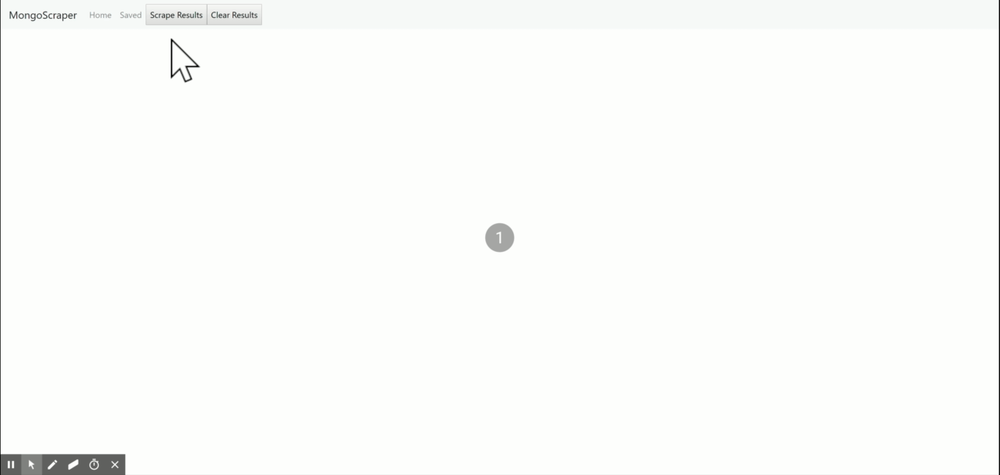

# MongoScraper
MongoScraper scrapes the website of The Atlantic Monthly for the most recently posted articles, renders them on the page, so users can save their favorites and add notes. A full-stack application built using Node, Express, Mongo, and Handlebars. Styling with Boostrap. M-V-C architecture.

Deployed with [Heroku](https://protected-shore-55580.herokuapp.com/). 

## Overview
Application consists of two pages:

* Main page. 
 * Allows users to click "Scrape Results" button, which runs an API "GET" request to server. The server makes an axios call to theatlantic.com, searches the website for specific HTML elements, and scrapes data from those elements. (The scrape is done with 'Cheerio' library, which utilizes JQuery-style coding to identify desired HTML elements.)
 * The scraped data is stored in the Mongo DB, and then returned to the client which is rendered into cards using Handlebars and Bootstrap. 
 * The user can click on the "Save Article" button on any given article, which makes an API "PUT" call to the server and saves the article into the MongoDB.

* Saved page.
 * When page is called, server queries database, retrieves saved articles, and sends them as a response to the client where it is rendered with handlebars. 
 * User can unsave article by clicking on "delete from saved" button on any article. This runs a Put request that updates the article in the database.
 * User can open notes by clicking on "Article Notes" button on any article. This opens a modal. The modal calls GET API call that retrieves and renders any notes. Users can add or delete notes with buttons that make respective POST and DELETE calls.

## Functionality

